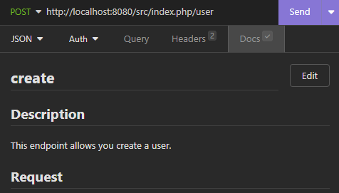

# Project README

### Project Scope

The goal of this project is to develop a API utilizing PHP and Node.js to handle user management, authentication, and project tracking functionalities. Docker will be used for containerization to ensure smooth deployment across various environments, and MySQL will serve as the database for storing user information, project details, and related data.

### Key Features

1. **User Management:**

   - Create/update user profiles with email and password.
   - Implement secure authentication mechanisms to generate and verify user tokens.

2. **Project Management:**

   - Develop endpoints for creating/updating projects.
   - Enable associations between users and their respective projects.
   - Allow projects to contain multiple articles.

3. **Article Management:**
   - Implement functionality to crud articles within projects.
   - Ensure proper validation and authentication for article operations.

## Requirements

### User Management

- Create/update user profiles including email and password.
- Implement secure authentication mechanisms to generate and verify user tokens.

### Project Management

- Develop endpoints for creating/updating projects.
- Enable associations between users and their respective projects.
- Allow projects to contain multiple articles.

### Article Management

- Implement functionality to crud articles within projects.
- Ensure proper validation and authentication for article operations.

## Running the Project with Docker

To run the project using Docker, follow these steps:

1. Clone this repository to your local machine.
2. Navigate to the project directory.
3. Ensure you have Docker installed on your system.

### setup node

1. Navigate to the `node` folder.
2. Modify the `.env.example` file with your desired configuration to `.env`.

### setup php

1. Navigate to the `php` folder.
2. Modify the `.env.example` file with your desired configuration to `.env`.
3. Ensure you have `composer` installed on your system.
4. Run `composer install`.

5. In the root folder run `docker compose up`

#### node available at http://localhost:3000/

#### php available at http://localhost:8080/

## Conclusion

We believe that with the implementation of these features and comprehensive documentation, our API will provide a solid foundation for managing user authentication and project tracking. If you have any questions or need further clarification, please don't hesitate to reach out.

Let's build something great together! 🚀

## Documentation

test the api using a collection that is at the root of this project `Insomnia`

documentation for each resource can be found in the insonmia collection

use phpmyAdminer to view the base data (project_deanta =node/deanta=php)
available at http://localhost:8081/

## Conclusion

I believe that with the implementation of these features and comprehensive documentation, our API will provide a solid foundation for managing user authentication and project tracking. If you have any questions or need further clarification, please don't hesitate to reach out.

Let's build something great together! 🚀
